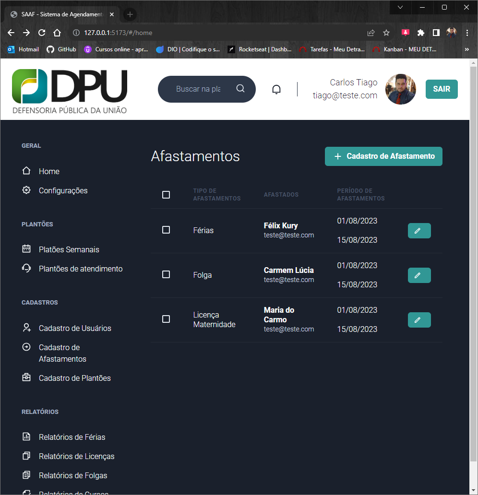

# React + TypeScript + Vite

SAAF - Sistema de Agendamento de Afastamento

Login


Home



🎯 Sobre
O projeto SAAF é um sistema de agendamento de afastamentos onde os usuários podem ter acesso aos seus afastamentos como, licensas, Folgas, Cursos dentre outros.
O Sistema possui um Cadastro de usuários, impressão de relatórios e um dahsbboard para consultar seus pedidos e afastamento. E todos os dados necessários para se fazer verificações de assinaturas ou dados dos usuários, estão Bsalvos no banco de dados.

🚀 Tecnologias
React
TypeScript
Yarn
Node


- [@vitejs/plugin-react](https://github.com/vitejs/vite-plugin-react/blob/main/packages/plugin-react/README.md) uses [Babel](https://babeljs.io/) for Fast Refresh
- [@vitejs/plugin-react-swc](https://github.com/vitejs/vite-plugin-react-swc) uses [SWC](https://swc.rs/) for Fast Refresh

## Expanding the ESLint configuration

If you are developing a production application, we recommend updating the configuration to enable type aware lint rules:

- Configure the top-level `parserOptions` property like this:

```js
   parserOptions: {
    ecmaVersion: 'latest',
    sourceType: 'module',
    project: ['./tsconfig.json', './tsconfig.node.json'],
    tsconfigRootDir: __dirname,
   },
```

- Replace `plugin:@typescript-eslint/recommended` to `plugin:@typescript-eslint/recommended-type-checked` or `plugin:@typescript-eslint/strict-type-checked`
- Optionally add `plugin:@typescript-eslint/stylistic-type-checked`
- Install [eslint-plugin-react](https://github.com/jsx-eslint/eslint-plugin-react) and add `plugin:react/recommended` & `plugin:react/jsx-runtime` to the `extends` list
